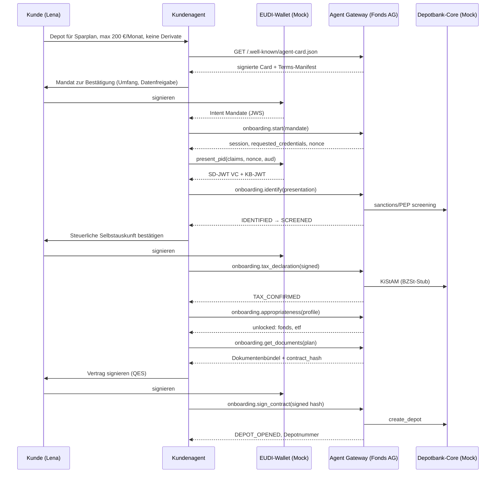

# 02 — Technisches Zielkonzept 2030 (working draft; completed during Phase 1)

## Leitidee
Jede gesetzliche Prüfung der heutigen Depoteröffnung bleibt bestehen; verändert wird, **wer** sie ausführt und **wie der Nachweis** entsteht: verifizierbar, maschinenlesbar, mit dem Menschen an genau den Stellen, die das Recht ihm vorbehält.

## Bausteine
1. **Agent Gateway der Fondsgesellschaft** — signierte Agent Card (`/.well-known/agent-card.json`), MCP-Tools `onboarding.*`, Terms-Manifest (jedes Datenfeld mit Rechtsgrundlage), Policy-Engine, Eskalationsqueue, hash-verketteter Audit-Trail.
2. **Mandat** — vom Kunden im Wallet signierte, zweck- und umfangsbegrenzte Vollmacht für den Agenten (Produktklassen, Beträge, Datenfreigaben, Laufzeit, Widerruf).
3. **EUDI-Wallet** — Identifizierung (PID, SD-JWT VC), Datenfreigabe nach Minimalprinzip, qualifizierte Signatur für Selbstauskunft und Vertrag.
4. **Kundenagent** — beliebige Plattform; muss Anbieter verifizieren, Mandat vorlegen, Human-only-Schritte an den Menschen zurückgeben.
5. **Partnerbank-Konsole** — nimmt Eskalationen und Beratungswünsche entgegen; löst den Kanalkonflikt durch Arbeitsteilung.
6. **Depotbank-Core** — System of Record; unverändert, angebunden über interne Services.

## Skalierung mit wachsenden Anforderungen
- Neue Pflicht = neue Regel in `rules.yaml` (mit Paragraf), kein neuer Code im Flow.
- Neuer Standard = neuer Adapter hinter einem Port (`AgentDiscovery`, `MandateVerifier`, `IdentityVerifier`, `SignatureService`).
- Neuer Kanal (Partnerbank-Agent, Firmenkunden mit European Business Wallet) = neue Mandats-Aussteller, gleiche Tools.
- Multi-Agent: Agent-Identität und Mandatskette sind im Audit-Trail; Delegation über signierte Ketten erweiterbar.

## Diagramme (to add: Mermaid → export to docs/assets/)
- Kontextdiagramm (C4 L1): Kunde, Agentplattform, Fondsgesellschaft, Depotbank, Partnerbank, Wallet-Issuer, BZSt, Aufsicht.
- Container-Diagramm (C4 L2): Gateway, Rules, Audit, Escalation, Core, Wallet, UI.
- Sequenzdiagramm Happy Path (Lena) — 9 Schritte.
- Sequenzdiagramm Eskalation (Marco).
- Zustandsautomat (aus 03_state-machine.md).

