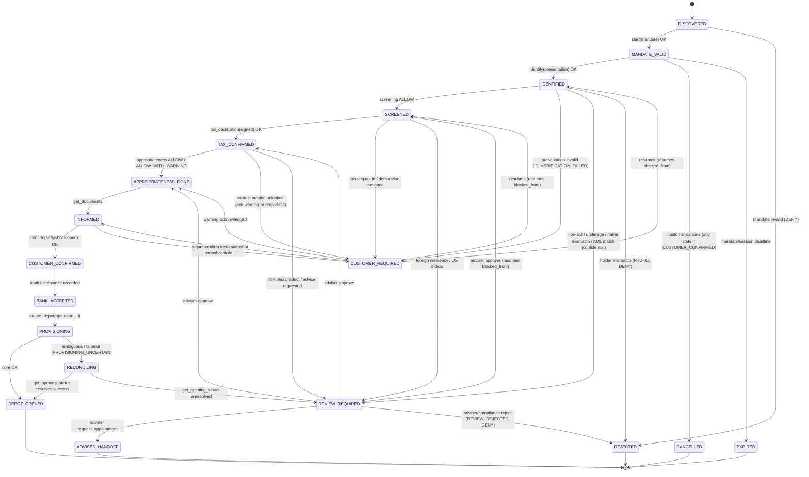

# 03 — Onboarding State Machine and Audit Trail (source of truth)

Every session (one customer, one Depot application, one mandate) moves through the states below. The gateway owns the state; the agent only observes it via `onboarding.status`. **Session-level authentication** (agent client registration + sender binding, §Guards) is checked on every call independently of the business state below.

## States

| State | Meaning | Entered by |
|---|---|---|
| `DISCOVERED` | Agent has verified the provider (verified provider directory + pinned card key), client-side; recorded when `onboarding.start` is called with `card_fingerprint` | `onboarding.start` |
| `MANDATE_VALID` | Signed Intent Mandate verified (signature, audience, expiry, scope schema) | `onboarding.start` |
| `IDENTIFIED` | Wallet PID presentation verified; GwG data set complete (name(s), birth date/place + country, nationality(ies), address, national id no.) | `onboarding.identify` |
| `SCREENED` | Sanctions/PEP screening done, beneficial owner = self declared, purpose recorded | automatic after `IDENTIFIED` |
| `TAX_CONFIRMED` | Tax ID present, residency self-certification signed by holder key, KiStAM lookup done | `onboarding.tax_declaration` |
| `APPROPRIATENESS_DONE` | Knowledge & experience profile evaluated; `service_mode` set; product classes unlocked; warnings stored | `onboarding.appropriateness` |
| `INFORMED` | Document bundle generated; immutable **snapshot** built (`snapshot_digest`, `revision`, product/pricing versions) | `onboarding.get_documents` |
| `CUSTOMER_CONFIRMED` | Customer confirmed **this snapshot** (holder-key signature over `snapshot_digest`) | `onboarding.sign_contract` (`/confirm`) |
| `BANK_ACCEPTED` | Gateway recorded bank acceptance as its own act (`accepted_at`, `contract_ref`); automatic in the demo when all gates are current | gateway |
| `PROVISIONING` | Exactly one core instruction per session, keyed by `operation_id` (= `session_id + ":create_depot"`) | gateway → core |
| `RECONCILING` | Core returned an ambiguous/timeout result; resolved by `get_opening_status(operation_id)`, never by a second create | core |
| `DEPOT_OPENED` | Core created Depot + Verrechnungskonto; Depot number returned | automatic after `PROVISIONING` |
| `CUSTOMER_REQUIRED` | The **customer** must act (declare, sign, acknowledge a §63(10) warning, choose another product); carries `reason_codes[]` + `blocked_from`; resolved by the agent calling `ask_human` and re-submitting the blocked tool. No adviser involved | rules engine |
| `REVIEW_REQUIRED` | **Staff** (partner-bank adviser or compliance) must decide; carries `reason_codes[]` + `blocked_from`; resolved via the escalation queue; resumes exactly at `blocked_from` | rules engine |
| `ADVISED_HANDOFF` | Adviser converted the case into an advisory appointment (terminal for the agent channel) | adviser decision |
| `EXPIRED` | Mandate/session deadline passed (terminal) | gateway |
| `CANCELLED` | Customer cancelled before `CUSTOMER_CONFIRMED` (terminal) | customer / agent |
| `REJECTED` | Terminal negative — a `DENY` outcome, or `REVIEW_REJECTED` after a documented adviser/compliance decision | rules engine / adviser / compliance |

## Transitions



`CANCELLED`/`EXPIRED` may be entered from any pre-`CUSTOMER_CONFIRMED` state (drawn once from `MANDATE_VALID` to keep the diagram readable).

## Policy vocabulary

Every `PolicyDecision` carries `policy_version` (= the `version` of `rules.yaml`), `rules[]` (each with `id`, `outcome`, `law`) and `reason_codes[]`. Outcomes:

| Outcome | Meaning | Effect on state |
|---|---|---|
| `ALLOW` | rule satisfied | forward transition |
| `ALLOW_WITH_WARNING` | proceed, warning stored | forward transition |
| `REQUIRE_CUSTOMER` | the customer must act | → `CUSTOMER_REQUIRED` (`blocked_from` = current) |
| `REQUIRE_REVIEW` | staff must decide | → `REVIEW_REQUIRED` (`blocked_from` = current) |
| `DENY` | terminal negative | → `REJECTED` |
| `ERROR` | pre-rule **guard** rejection | none (envelope only, retryable) |

**Aggregation precedence** (a step evaluates several rules): `ERROR` (guards, evaluated before the engine) short-circuits first; among engine outcomes the most restrictive wins: `DENY` > `REQUIRE_REVIEW` > `REQUIRE_CUSTOMER` > `ALLOW_WITH_WARNING` > `ALLOW`. Example (Marco, appropriateness): `PRODUCT_OUTSIDE_UNLOCKED` (`REQUIRE_CUSTOMER`) + `COMPLEX_PRODUCT` (`REQUIRE_REVIEW`) ⇒ `REVIEW_REQUIRED`.

## Guards (enforced in `gateway/state.py`, before the rules engine)

- **State guard:** a tool may only be called in the state that precedes its target; otherwise `WRONG_STATE`.
- **Session/auth guards (`ERROR`, per call):** agent client registered and active (`R-MND-05` → `CLIENT_UNREGISTERED`); `x-sender-proof` valid — signature, unused `jti`, `iat` within 60 s, and `mandate.agent.id == proof.client_id` (`R-MND-06` → `SENDER_BINDING_INVALID`); mandate scope (`R-MND-01` → `MANDATE_SCOPE_EXCEEDED`) and expiry (`R-MND-02` → `MANDATE_EXPIRED`). Guards return the error envelope, leave state **unchanged**, and are **retryable**; they never transition to `REJECTED`.
- **Revocation on writes:** every state-changing call re-checks the mandate `revocation_url` and the client status; a hit is `MANDATE_REVOKED` (`R-MND-03`, `DENY`).
- **Every guard rejection is audited:** append an `AuditEvent` with `from_state == to_state`, `actor: "agent"`, the attempted `tool`, and the `reason_codes` (this is what the `P3-01` manipulation demo reads).
- `CUSTOMER_REQUIRED` / `REVIEW_REQUIRED` store `blocked_from`. Resolution never skips ahead more than the blocked step: a **customer** resolution re-runs the step from `blocked_from` (the customer supplied the missing thing); a **review** approval *completes* the blocked step — the staff manual check replaces the automated gate, so it advances to that step's target state (e.g. `REVIEW_REQUIRED → TAX_CONFIRMED`). Reject → `REVIEW_REJECTED → REJECTED`; request_appointment → `ADVISED_HANDOFF`.

## Confidential compliance status (GwG § 47)

For `REVIEW_REQUIRED` caused by an `AML_*` code (rule flagged `confidential: true`), the envelope returned to the agent/customer carries `reason_codes: ["IN_REVIEW"]` and the German text "Ihr Antrag wird geprüft." The real reason codes and match details are visible **only** in the Ops console and the audit log.

## Reason codes (final)

| Code | Outcome | Rule id |
|---|---|---|
| `MANDATE_SCOPE_EXCEEDED` | ERROR (guard) | R-MND-01 |
| `MANDATE_EXPIRED` | ERROR (guard) | R-MND-02 |
| `MANDATE_REVOKED` | DENY | R-MND-03 |
| `AGENT_UNVERIFIED` | DENY | R-MND-04 |
| `CLIENT_UNREGISTERED` | ERROR (guard) | R-MND-05 |
| `SENDER_BINDING_INVALID` | ERROR (guard) | R-MND-06 |
| `ID_VERIFICATION_FAILED` | REQUIRE_CUSTOMER | R-ID-01 |
| `ID_NON_EU_DOCUMENT` | REQUIRE_REVIEW | R-ID-02 |
| `ID_UNDERAGE` | REQUIRE_REVIEW | R-ID-03 |
| `NAME_MISMATCH_REFERENCE_ACCOUNT` | REQUIRE_REVIEW | R-ID-04 |
| `HOLDER_MANDATE_MISMATCH` | DENY | R-ID-05 |
| `AML_SANCTIONS_HIT` | REQUIRE_REVIEW (confidential) | R-AML-01 |
| `AML_PEP_HIT` | REQUIRE_REVIEW (confidential) | R-AML-02 |
| `AML_HIGH_RISK_COUNTRY` | REQUIRE_REVIEW (confidential) | R-AML-03 |
| `IN_REVIEW` | REQUIRE_REVIEW (masked value shown to agent) | — (§ masking) |
| `TAX_ID_MISSING` | REQUIRE_CUSTOMER | R-TAX-01 |
| `TAX_FOREIGN_RESIDENCY` | REQUIRE_REVIEW | R-TAX-02 |
| `TAX_US_INDICIA` | REQUIRE_REVIEW | R-TAX-03 |
| `TAX_DECLARATION_UNSIGNED` | REQUIRE_CUSTOMER | R-TAX-04 |
| `PRODUCT_OUTSIDE_UNLOCKED` | REQUIRE_CUSTOMER | R-WPHG-01 |
| `ADVICE_REQUESTED` | REQUIRE_REVIEW | R-WPHG-02 |
| `COMPLEX_PRODUCT` | REQUIRE_REVIEW | R-WPHG-03 |
| `CONTRACT_UNSIGNED` | REQUIRE_CUSTOMER | R-CTR-01 |
| `SNAPSHOT_STALE` | REQUIRE_CUSTOMER | R-CTR-02 |
| `PROVISIONING_UNCERTAIN` | → `RECONCILING` | (core mock) |
| `REVIEW_REJECTED` | DENY | (adviser/compliance) |
| `REFERRAL_INVALID` | audit note only (never blocks) | (referral check) |

`R-SVC-01` (service-mode classification) is informational (`ALLOW`) and carries no reason code.

## Idempotency and reconciliation

`create_depot` is issued exactly once per session, keyed by `operation_id = session_id + ":create_depot"` (unique constraint in the core). If the core returns ambiguous/timeout (`PROVISIONING_UNCERTAIN`), the session enters `RECONCILING`; the gateway resolves it with `get_opening_status(operation_id)` — never a second create. A duplicate `create_depot` with the same `operation_id` returns the stored result (same Depot number, count stays one).

## Audit event

```json
{
  "seq": 12,
  "ts": "2026-09-14T10:15:02.123Z",
  "session_id": "ses_8f3…",
  "actor": "human | agent | gateway | adviser | compliance | core",
  "from_state": "SCREENED",
  "to_state": "TAX_CONFIRMED",
  "tool": "onboarding.tax_declaration",
  "revision": 3,
  "reason_codes": [],
  "rules": [{"id": "R-TAX-02", "outcome": "ALLOW", "law": "FKAustG §3a Abs. 2"}],
  "policy_version": "1.1.0",
  "rules_version": "1.1.0",
  "evidence_hash": "sha256:…",
  "mandate_id": "mnd_…",
  "prev_hash": "sha256:…",
  "hash": "sha256:…"
}
```

A guard rejection appends an event with `from_state == to_state`, `actor: "agent"`, the attempted `tool`, and the `reason_codes` (e.g. `["MANDATE_SCOPE_EXCEEDED"]`); the state is a no-op but the attempt is permanently recorded. For confidential `AML_*` reviews, the audit log stores the **real** codes; only the agent-facing envelope is masked to `IN_REVIEW`.

`verify_chain(session_id)` recomputes hashes and returns the first broken link, if any. The UI shows the chain status as a badge.
