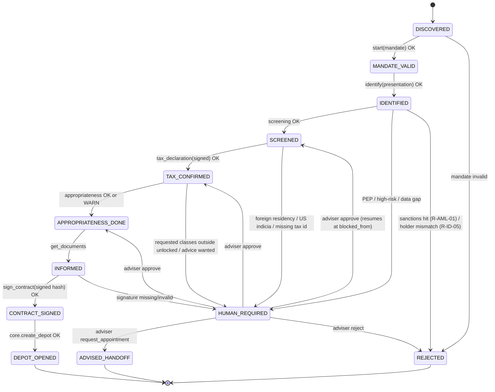

# 03 — Onboarding State Machine and Audit Trail (source of truth)

Every session (one customer, one Depot application, one mandate) moves through the states below. The gateway owns the state; the agent only observes it via `onboarding.status`.

## States

| State | Meaning | Entered by |
|---|---|---|
| `DISCOVERED` | Agent has verified the provider's Agent Card (client-side; recorded when `onboarding.start` is called with `card_fingerprint`) | `onboarding.start` |
| `MANDATE_VALID` | Signed Intent Mandate verified (signature, audience, expiry, scope schema) | `onboarding.start` |
| `IDENTIFIED` | Wallet PID presentation verified; GwG data set complete (name(s), birth date/place, nationality(ies), address, national id no.) | `onboarding.identify` |
| `SCREENED` | Sanctions/PEP screening done, beneficial owner = self declared, purpose recorded | automatic after `IDENTIFIED` |
| `TAX_CONFIRMED` | Tax ID present, residency self-certification signed by holder key, KiStAM lookup done | `onboarding.tax_declaration` |
| `APPROPRIATENESS_DONE` | Knowledge & experience profile evaluated; product classes unlocked; warnings stored | `onboarding.appropriateness` |
| `INFORMED` | Document bundle generated and delivered (hash recorded) | `onboarding.get_documents` |
| `CONTRACT_SIGNED` | Holder-key signature over `contract_hash` verified | `onboarding.sign_contract` |
| `DEPOT_OPENED` | Core created Depot + Verrechnungskonto; Depot number returned | automatic after `CONTRACT_SIGNED` |
| `HUMAN_REQUIRED` | Blocked pending adviser decision; carries `reason_codes[]` and `blocked_from` state | rules engine |
| `ADVISED_HANDOFF` | Adviser converted the case into an advisory appointment (terminal for the agent channel) | adviser decision |
| `REJECTED` | Terminal negative (e.g. sanctions hit confirmed, mandate revoked) | rules engine / adviser |

## Transitions



Guards (all enforced in `gateway/state.py`):
- A tool may only be called in the state that precedes its target; otherwise `ErrorCode.WRONG_STATE`.
- **Pre-rule guards vs. terminal rejection.** Before the rules engine runs, every tool call is checked against the mandate scope (`R-MND-01` → `MANDATE_SCOPE_EXCEEDED`) and expiry (`R-MND-02` → `MANDATE_EXPIRED`), independent of state. These two are **guards**: they return the error envelope (`{ok:false, error:{…}}`), leave the session state **unchanged**, and are **retryable** (the agent can re-issue a call within scope, or obtain a fresh mandate). They never transition to `REJECTED`. In contrast, `R-MND-03` (`MANDATE_REVOKED`), `R-MND-04` (`AGENT_UNVERIFIED`) and `R-AML-01` (`AML_SANCTIONS_HIT`) — and `R-ID-05` (`HOLDER_MANDATE_MISMATCH`) — carry `outcome: REJECT` and transition to the terminal `REJECTED` state.
- **Every guard rejection is audited.** A guard rejection MUST append an `AuditEvent` with `from_state == to_state` (state unchanged), `actor: "agent"`, the attempted `tool`, and the `reason_codes`, so blocked attempts are visible in the trail (this is what the `P3-01` manipulation demo reads).
- `HUMAN_REQUIRED` stores `blocked_from`; approval resumes exactly there, never skipping steps.

## Reason codes (`HUMAN_REQUIRED` / `REJECT`)

| Code | Trigger | Rule id |
|---|---|---|
| `ID_VERIFICATION_FAILED` | presentation invalid | R-ID-01 |
| `ID_NON_EU_DOCUMENT` | nationality outside EU/EEA and no eIDAS credential | R-ID-02 |
| `ID_UNDERAGE` | age < 18 | R-ID-03 |
| `NAME_MISMATCH_REFERENCE_ACCOUNT` | IBAN holder ≠ identified person | R-ID-04 |
| `HOLDER_MANDATE_MISMATCH` | PID key binding (`cnf`) ≠ mandate signer (`iss`) | R-ID-05 |
| `AML_SANCTIONS_HIT` | screening hit | R-AML-01 |
| `AML_PEP_HIT` | PEP list hit | R-AML-02 |
| `AML_HIGH_RISK_COUNTRY` | residence/nationality in high-risk list | R-AML-03 |
| `TAX_ID_MISSING` | no Steuer-ID | R-TAX-01 |
| `TAX_FOREIGN_RESIDENCY` | residency outside DE declared | R-TAX-02 |
| `TAX_US_INDICIA` | US citizenship/birthplace/address | R-TAX-03 |
| `TAX_DECLARATION_UNSIGNED` | self-certification not holder-signed | R-TAX-04 |
| `PRODUCT_OUTSIDE_UNLOCKED` | mandate/product class not covered by experience | R-WPHG-01 |
| `ADVICE_REQUESTED` | customer or agent asks for a recommendation | R-WPHG-02 |
| `COMPLEX_PRODUCT` | derivatives/leveraged/certificates in scope | R-WPHG-03 |
| `CONTRACT_UNSIGNED` | contract hash not holder-signed | R-CTR-01 |
| `MANDATE_SCOPE_EXCEEDED` | call exceeds amount/class/time in mandate | R-MND-01 |
| `MANDATE_EXPIRED` | `exp` passed | R-MND-02 |
| `MANDATE_REVOKED` | revocation list hit | R-MND-03 |
| `AGENT_UNVERIFIED` | agent identity missing/invalid | R-MND-04 |

## Audit event

```json
{
  "seq": 12,
  "ts": "2026-09-14T10:15:02.123Z",
  "session_id": "ses_8f3…",
  "actor": "human | agent | gateway | adviser | core",
  "from_state": "SCREENED",
  "to_state": "TAX_CONFIRMED",
  "tool": "onboarding.tax_declaration",
  "reason_codes": [],
  "rules": [{"id": "R-TAX-02", "outcome": "OK", "law": "FKAustG §3a Abs. 2"}],
  "evidence_hash": "sha256:…",         // hash of the payload that satisfied the step
  "mandate_id": "mnd_…",
  "prev_hash": "sha256:…",
  "hash": "sha256:…"                    // sha256(canonical(event without hash))
}
```

A guard rejection (see Guards above) appends an event with `from_state == to_state`, `actor: "agent"`, the attempted `tool`, and the `reason_codes` (e.g. `["MANDATE_SCOPE_EXCEEDED"]`); the transition is a no-op on state but the attempt is permanently recorded in the chain.

`verify_chain(session_id)` recomputes hashes and returns the first broken link, if any. The UI shows the chain status as a badge.
